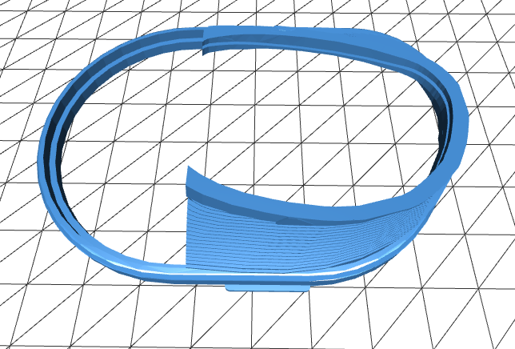

# pimax_lens_adapter
A prescription lens adapter for the Pimax 8KX

This is a prescription lens adapter made for the Pimax 8KX.  This may also fit the 8K and 5K+ but YMMV

This adapter is sized for these inexpensive lenses from Zenni Optical:

[Zenni Aviator 418911](https://www.zennioptical.com/p/full-rim-metal-alloy-with-spring-hinge/4189?skuId=418911)

The design is remixed from a couple of designs hosted on Thingiverse:

[Pimax Customized Prescription VR Frame by Hanky](https://www.thingiverse.com/thing:4179665)

and
 
[Pimax 5k+ 8k Prescription VR Frame for large IPD](https://www.thingiverse.com/thing:4090166)

Printing guide:

I printed these with regular PLA, in a layer height of 0.12mm and 100% infill.

I printed with supports under the lens wings but with good print cooling this may not be necessary.

The outer ring has two small tabs which can seat just under the edge of the fabric over the Pimax lenses, there is a small lifted area around the lens that they should slide under.

I chose to make this design to minize issues with the face gasket fit from the floating frame design, and to also add rigidity to the outer insert ring which had a tendency to pop out in my other attempts. The lenses from the Zenni glasses should pop right in and are held strongly, and the lens assembly holds securely against the Pimax lenses.

Note that you will be placing these adapters directly on top of your Pimax HMD's lenses when using these, you assume all responsibility for any scratches or damages that occur from this.  I recommend sticking to a soft plastic like PLA to reduce the chances of scratching the Pimax lens.

NOTE:  I used Tinkercad for this model (I know, I know..), so there are some rough spots and it could easily use optimization.  Please feel free to remix this, and I would love pull requests that improve the STL while keeping this functionally identical.
